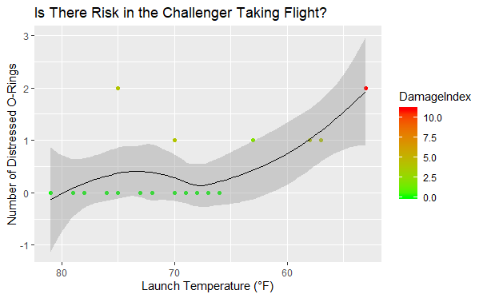

```{r setup, include=FALSE}
knitr::opts_chunk$set(include = FALSE)

library(dplyr)
library(data.table)
library(ggplot2)
```

```{r Loading in Data, include=FALSE}
ChallengerData <- read.csv(file = file.choose())
```

### Assignment 3 Description:
#### We know the challenger blew up. There was a conflict the night before between two groups of engineers. One group was trying to explain why it shouldn't launch....The info is in this data. Create a better data visualization to explain why it isn't a good idea to launch that day.

- I renamed the columns from V1-V5 to new column names accordingly.
```{r Renaming the Columns, echo=TRUE}
ChallengerData <- ChallengerData %>% 
  rename(
    ORingsAtRisk = V1,
    ORingDistress = V2,
    LaunchTemp = V3,
    LeakCheckPressure = V4,
    FlightNumber = V5
  )
```

- I took the Damage Index column from Chip's email and cbinded it into the rest of the Challenger data.
```{r Adding in Damage Index, echo=TRUE}
DamageIndex <- data.table(DamageIndex = c(0, 4, 0, 0, 0, 0, 0, 0, 4, 2, 4, 0, 0, 11, 0, 0, 0, 0, 0, 0, 4, 0, 4))

ChallengerData <- cbind(ChallengerData,DamageIndex)
```


The below data visualization shows why there is risk of taking flight in low temperatures.
```{r Plot, warning=FALSE}
ggplot(data = ChallengerData, mapping = aes(x = LaunchTemp, y = ORingDistress, color = DamageIndex)) +
  scale_colour_gradient(low = "green", high = "red") +
  geom_point() +
  geom_smooth(colour = "black", size=0.5) +
  scale_x_reverse() +
  labs(title = "Is There Risk in the Challenger Taking Flight?", x = "Launch Temperature (°F)", y = "Number of Distressed O-Rings")
  
```



As one can see, its clear that as the temperature gets lower the number of distressed o-rings increases. Not only does this increase, but the damage index also increases, as shown on the left-hand side legend. This clearly shows that even though two o-rings distress, the damage index is less drastic in the warmer temperatures compared to if two o-rings were to become distressed in lower temperatures. Adding in the loess smoother shows a upward trend in the number of distressed o-rings, predicting that when the temperature becomes colder there seems to be more technical difficulties that could result in tragedies.