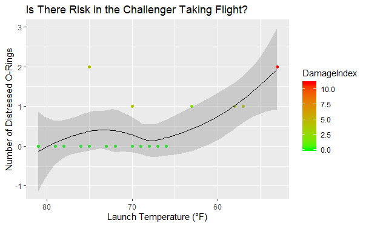

### Assignment 3 Description:

#### We know the challenger blew up. There was a conflict the night before between two groups of engineers. One group was trying to explain why it shouldn’t launch….The info is in this data. Create a better data visualization to explain why it isn’t a good idea to launch that day.

  - I renamed the columns from V1-V5 to new column names accordingly.

  - I took the Damage Index column from Chip’s email and cbinded it into
    the rest of the Challenger data.

The below data visualization shows why there is risk of taking flight in
low temperatures.

As one can see, its clear that as the temperature gets lower the number
of distressed o-rings increases. Not only does this increase, but the
damage index also increases, as shown on the left-hand side legend. This
clearly shows that even though two o-rings distress, the damage index is
less drastic in the warmer temperatures compared to if two o-rings were
to become distressed in lower temperatures. Adding in the loess smoother
shows a upward trend in the number of distressed o-rings, predicting
that when the temperature becomes colder there seems to be more
technical difficulties that could result in tragedies.
